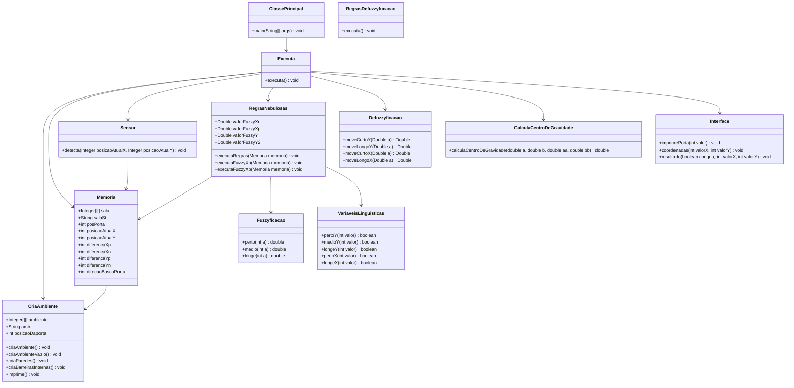
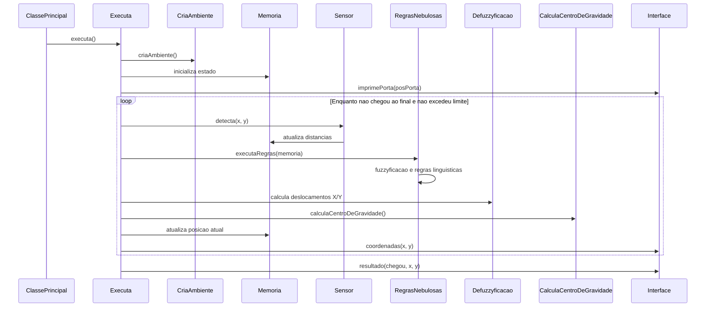

# Implementacao Robo Fuzzy

## Objetivo

Este projeto simula um robo que se desloca dentro de uma sala representada por uma matriz 50x50. O objetivo do robo e encontrar a porta de saida usando uma estrategia baseada em logica fuzzy.

O sistema cria automaticamente o ambiente, posiciona paredes, barreiras internas e uma porta na ultima linha da matriz. A cada passo, o robo usa sensores para medir a distancia ate obstaculos proximos, aplica regras nebulosas, calcula deslocamentos e atualiza sua posicao ate chegar na porta ou atingir o limite maximo de movimentos.

## Descricao Geral

A sala e modelada por uma matriz de inteiros:

| Valor | Significado |
| --- | --- |
| `0` | Espaco livre |
| `1` | Parede ou barreira |
| `2` | Porta |

O robo inicia na posicao `(x=1, y=1)`. A porta e criada em uma posicao aleatoria na borda inferior da sala. As barreiras internas sao criadas em linhas horizontais com aberturas, obrigando o robo a procurar passagem antes de continuar descendo.

O controle do movimento combina duas ideias:

1. Sensoriamento do ambiente nas direcoes direita, esquerda, acima e abaixo.
2. Regras fuzzy para decidir deslocamentos curtos ou longos em `X` e `Y`.

Quando o caminho abaixo esta livre, o robo prioriza avancar para baixo. Quando existe obstaculo abaixo, ele busca lateralmente uma abertura, alternando a direcao quando encontra uma parede.

## Tecnologias

- Java 8
- Maven
- Aplicacao de console

## Estrutura do Projeto

```text
src/main/java/implementacaorobofuzzy
├── app
│   └── ClassePrincipal.java
├── ambiente
│   ├── CriaAmbiente.java
│   └── Memoria.java
├── controle
│   └── Executa.java
├── fuzzy
│   ├── CalculaCentroDeGravidade.java
│   ├── Defuzzyficacao.java
│   ├── Fuzzyficacao.java
│   ├── RegrasDefuzzyfucacao.java
│   ├── RegrasNebulosas.java
│   └── VariaveisLinguisticas.java
├── sensor
│   └── Sensor.java
└── ui
    └── Interface.java
```

## Como Usar

### Pre-requisitos

Tenha instalado:

- JDK 8 ou superior
- Maven

### Executar pelo Maven

Na raiz do projeto, execute:

```bash
mvn clean compile exec:java
```

O plugin `exec-maven-plugin` esta configurado para iniciar a classe:

```text
implementacaorobofuzzy.app.Main
```

### Gerar o arquivo JAR

```bash
mvn clean package
```

Depois, execute:

```bash
java -jar target/implementacao-robo-fuzzy-1.0.0.jar
```

## Funcionamento

### 1. Inicializacao

A execucao comeca em `Main`, que cria um objeto `Executa` e chama o metodo `executa()`.

```java
Executa executa = new Executa();
executa.executa();
```

### 2. Criacao do Ambiente

A classe `CriaAmbiente` cria uma matriz 50x50, preenche todos os espacos com `0`, adiciona paredes nas bordas, sorteia a posicao da porta e cria barreiras internas.

Principais responsabilidades:

- `criaAmbienteVazio()`: inicializa a matriz com espacos livres.
- `criaParedes()`: adiciona paredes nas bordas e cria a porta.
- `criaBarreirasInternas()`: adiciona barreiras horizontais com aberturas.
- `imprime()`: monta a representacao textual do ambiente.

### 3. Memoria do Sistema

A classe `Memoria` guarda o estado compartilhado da simulacao:

- Matriz da sala.
- Posicao atual do robo.
- Posicao da porta.
- Distancias detectadas pelos sensores.
- Direcao usada na busca lateral pela porta ou por aberturas.

### 4. Sensoriamento

A classe `Sensor` verifica a distancia ate obstaculos em quatro direcoes:

- `diferencaXp`: distancia livre para a direita.
- `diferencaXn`: distancia livre para a esquerda.
- `diferencaYp`: distancia livre para cima.
- `diferencaYn`: distancia livre para baixo.

O alcance maximo do sensor e `6` celulas.

### 5. Fuzzyficacao

A classe `Fuzzyficacao` converte distancias numericas em graus de pertinencia fuzzy:

- `perto(int a)`
- `medio(int a)`
- `longe(int a)`

A classe `Fuzzyficacao` define as faixas linguisticas usadas pelas regras:

| Variavel | Regra |
| --- | --- |
| `pertoY` | `0 <= valor < 2` |
| `medioY` | `1 <= valor < 4` |
| `longeY` | `3 <= valor <= 5` |
| `pertoX` | `valor == 0` |
| `longeX` | `valor > 0` |

### 6. Regras Nebulosas

A classe `RegrasNebulosas` avalia as distancias medidas e ativa flags logicas que indicam quais movimentos devem ser considerados.

Exemplos:

- Se o obstaculo abaixo esta perto, o sistema avalia tambem as distancias laterais.
- Se o lado esquerdo esta perto, o robo tende a se deslocar para a direita.
- Se o lado direito esta perto, o robo tende a se deslocar para a esquerda.
- Se existe espaco abaixo, o robo prioriza continuar descendo.

### 7. Defuzzyficacao

A classe `Defuzzyficacao` transforma os graus fuzzy em deslocamentos concretos:

| Metodo | Resultado |
| --- | --- |
| `moveCurtoY(a)` | `2 * a + 1` |
| `moveLongoY(a)` | `2 * a + 3` |
| `moveCurtoX(a)` | `a` |
| `moveLongoX(a)` | `1.0` |

A classe `CalculaCentroDeGravidade` combina os valores fuzzy usando media ponderada:

```text
resultado = (a * aa + b * bb) / (a + b)
```

Se o denominador for zero, o deslocamento retornado e `0`.

### 8. Movimento do Robo

O laco principal continua enquanto:

- O robo ainda nao chegou na ultima linha da matriz.
- O numero de passos ainda nao ultrapassou o limite maximo.

O limite maximo de passos e:

```java
memoria.sala.length * memoria.sala[0].length
```

Em uma matriz 50x50, isso representa ate `2500` passos.

Ao final, a interface imprime se o robo chegou ou nao na porta e mostra a posicao final.

## Saida Esperada

Durante a execucao, o console mostra:

- A matriz da sala.
- A posicao da porta.
- As coordenadas percorridas pelo robo.
- O resultado final da simulacao.

Exemplo de mensagens:

```text
A PORTA ESTA LOCALIZADA NA POSICACAO: 35
coordenadaX: 1
coordenadaY: 2

O ROBO CHEGOU NA PORTA.
posicaoFinalX: 35
posicaoFinalY: 49
```

Como a porta e as aberturas das barreiras sao sorteadas, a saida pode mudar a cada execucao.

## UML - Diagrama de Classes



## UML - Fluxo de Execucao



## Observacoes

- A classe `RegrasDefuzzyfucacao` existe como ponto reservado para futuras regras de defuzzyficacao, mas atualmente nao participa do fluxo principal.
- A simulacao usa varios atributos `static` em `Memoria`, `CriaAmbiente` e `RegrasNebulosas`, o que simplifica o compartilhamento de estado, mas deixa a execucao menos isolada para cenarios com multiplas simulacoes ao mesmo tempo.
- Como o ambiente e aleatorio, duas execucoes podem produzir caminhos e resultados diferentes.
